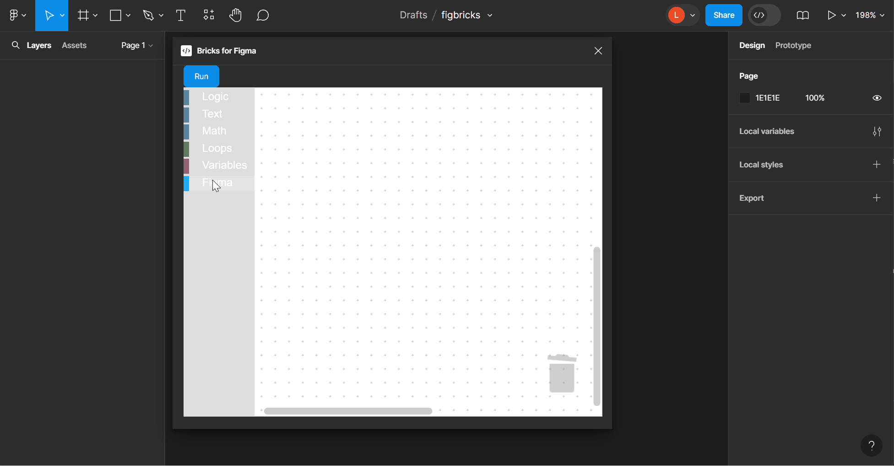

# Bricks for Figma

This is a visual code editor for easily automating your Figma document.

It's created with [Blockly](https://developers.google.com/blockly) and the [Figma Plugin API](https://www.figma.com/plugin-docs/).

### Create a rectangle



### Or Create 5 rectangles


## Development guide

*This plugin is built with [Create Figma Plugin](https://yuanqing.github.io/create-figma-plugin/).*

### Pre-requisites

- [Node.js](https://nodejs.org) – v20
- [Figma desktop app](https://figma.com/downloads/)

### Build the plugin

To build the plugin:

```
$ npm run build
```

This will generate a [`manifest.json`](https://figma.com/plugin-docs/manifest/) file and a `build/` directory containing the JavaScript bundle(s) for the plugin.

To watch for code changes and rebuild the plugin automatically:

```
$ npm run watch
```

### Install the plugin

1. In the Figma desktop app, open a Figma document.
2. Search for and run `Import plugin from manifest…` via the Quick Actions search bar.
3. Select the `manifest.json` file that was generated by the `build` script.

### Debugging

Use `console.log` statements to inspect values in your code.

To open the developer console, search for and run `Show/Hide Console` via the Quick Actions search bar.

## See also

- [Create Figma Plugin docs](https://yuanqing.github.io/create-figma-plugin/)
- [`yuanqing/figma-plugins`](https://github.com/yuanqing/figma-plugins#readme)

Official docs and code samples from Figma:

- [Plugin API docs](https://figma.com/plugin-docs/)
- [`figma/plugin-samples`](https://github.com/figma/plugin-samples#readme)
